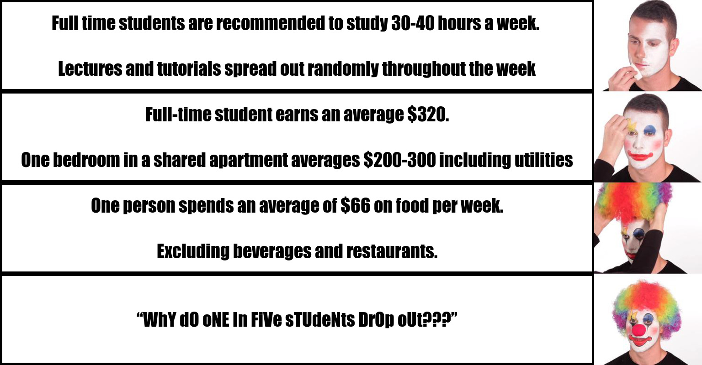

# My Meme
## This is my meme that I have created

### My motivation

The meme


```r
library(magick)
#Meme text
text1 <- image_blank(width = 1290, heigh = 190, color = "#FFFFFF") %>%
    image_annotate(text = "Full time students are recommended to study 30-40 hours a week. 
                   \nLectures and tutorials spread out randomly throughout the week", color = "#000000", 
                   size = 40, font = "Impact", gravity = "center") %>%
  image_border(color = "#000000", "5x5")

text2 <- image_blank(width = 1290, heigh = 190, color = "#FFFFFF") %>%
  image_annotate(text = "Full-time student earns an average $320.
                 \nOne bedroom in a shared apartment averages $200-300 including utilities", color = "#000000", 
                 size = 40, font = "Impact", gravity = "center") %>%
  image_border(color = "#000000", "5x5")

text3 <- image_blank(width = 1290, heigh = 190, color = "#FFFFFF") %>%
  image_annotate(text = "One person spends an average of $66 on food per week.
                 \nExcluding beverages and restaurants.", color = "#000000", 
                 size = 40, font = "Impact", gravity = "center") %>%
  image_border(color = "#000000", "5x5")

text4 <- image_blank(width = 1290, heigh = 190, color = "#FFFFFF") %>%
  image_annotate(text = "“WhY dO oNE In FiVe sTUdeNts DrOp oUt???”", color = "#000000", 
                 size = 40, font = "Impact", gravity = "center") %>%
  image_border(color = "#000000", "5x5")

meme_text <- c(text1, text2, text3, text4)

comb_text <- image_append(meme_text, stack = TRUE)

clown <- image_read("https://i.kym-cdn.com/photos/images/newsfeed/001/563/849/d1f.jpg") %>% 
  image_crop("680x779+450") %>%
  image_scale("x800")
clown

meme_vector <- c(comb_text, clown)

meme <- image_append(meme_vector)

meme

image_write(meme, path = "MyMeme.jpg", format = "jpg")
```
